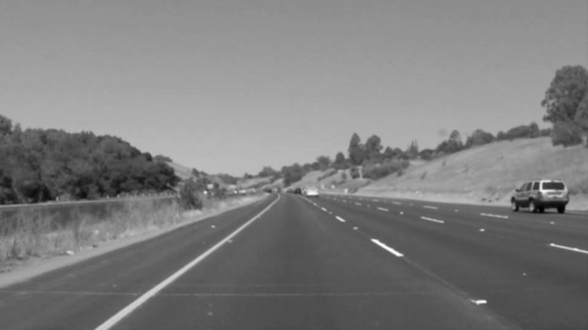
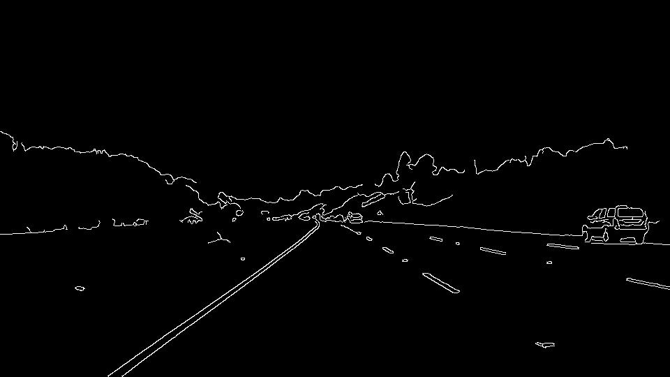
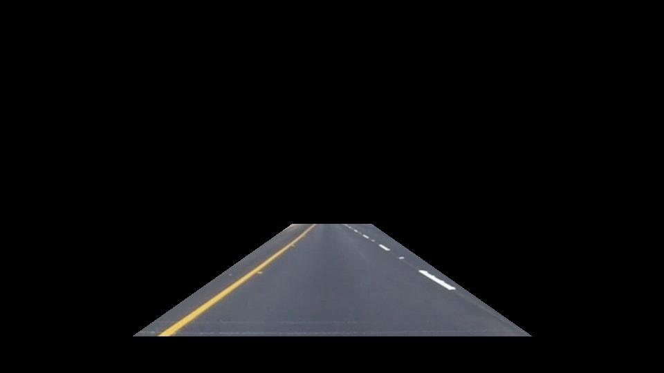
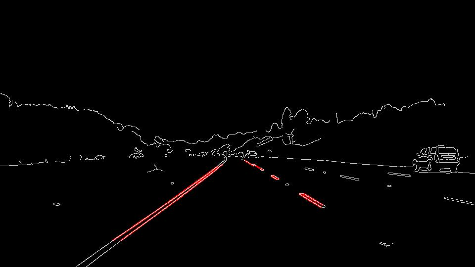
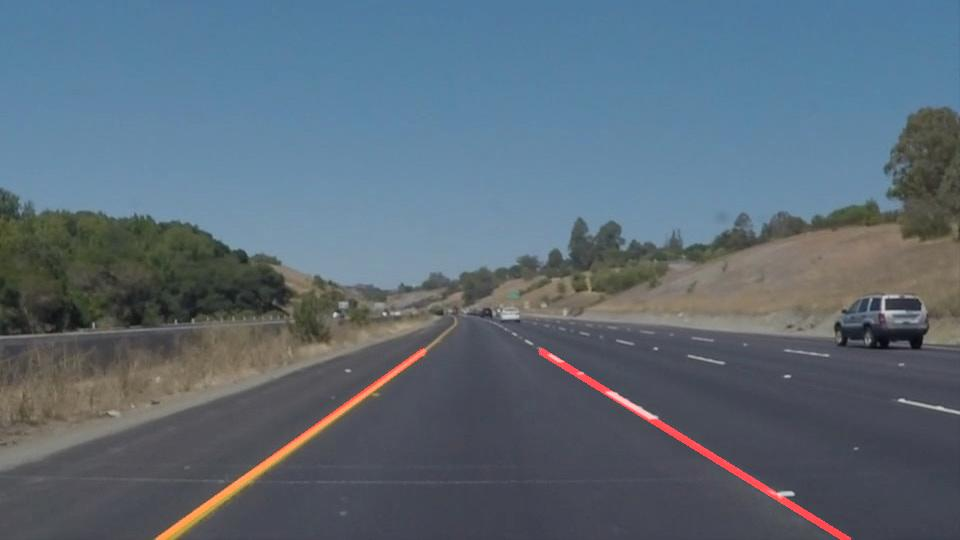

# **Finding Lane Lines on the Road** 

## Writeup Template

### You can use this file as a template for your writeup if you want to submit it as a markdown file. But feel free to use some other method and submit a pdf if you prefer.

---

**Finding Lane Lines on the Road**

The goals / steps of this project are the following:
* Make a pipeline that finds lane lines on the road
* Reflect on your work in a written report

[//]: # (Image References)

[image1]: ./examples/grayscale.jpg "Grayscale"

---

### Reflection

### 1. Describe your pipeline. As part of the description, explain how you modified the draw_lines() function.
As an example, the pipeline output is shown for the following picture;

The pipeline consisted of 5 steps. 
1. First, the images are converted to grayscale.

2. A Gaussian Blur is applied with a Kernel size of 5

3. Canny Edge detection is performed with the parameters
  * Lower Threshold: 60
  * Upper Threshold: 200
 

4. The region of interest is defined and masked from the original image. A polygon with four corners is choosen with the following static vertix values:
  * Bottom Left: 110, 540
  * Top Right: 430, 330
  * Top Left: 530, 330
  * Bottom Right: 920, 540
  

5. A Hough-Transformation is applied with the parameters:
  * Rho: 2
  * Theta: pi/180
  * Threshold: 40
  * Minimum line length: 5
  * Maximum line gap: 10
Result from Hough-Transformation:

6. Finally, the detected lines from the Hough Transformation are averaged and overlayed with the original image

In order to draw a single line on the left and right lanes, I modified the draw_lines() function by separating the detected lines from the Hough-Transofrmation into two categories:
* The ones with positive slope, i.e. these lines are on the right side of the vehicle
* The ones with negative slope, i.e. these lines are on the left side of the vehicle
For each of the set of positive / negative slopes, a polynomial fit of first order (straight) is performed to obtain a slope and bias that best fits the data on each side. The resulting lines are then plotted in the edges image.

### 2. Identify potential shortcomings with your current pipeline

One potential shortcoming would be what would happen when the road makes a sharp turn, e.g. like in the challenge video. If the region of interest is static, it will have dificulties detecting the edges. 

Another shortcoming could be if the street has temporary lane markers over the regular ones. The current pipeline cannot distinguish which of the lane markers are the ones that currently are the ones to follow.

### 3. Suggest possible improvements to your pipeline

A possible improvement would be to combine the yaw rate of the vehicle with the region of interest. E.g. if the vehicle is turning right the region, the region of interest should also be bend to the right.

Another potential improvement could be to include a prioritization, i.e. to detect lanes of different colours and include a decision on which lane colour is currently valid.
